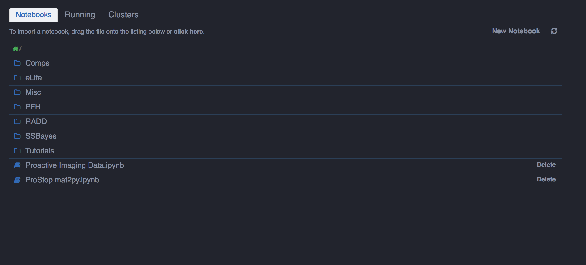
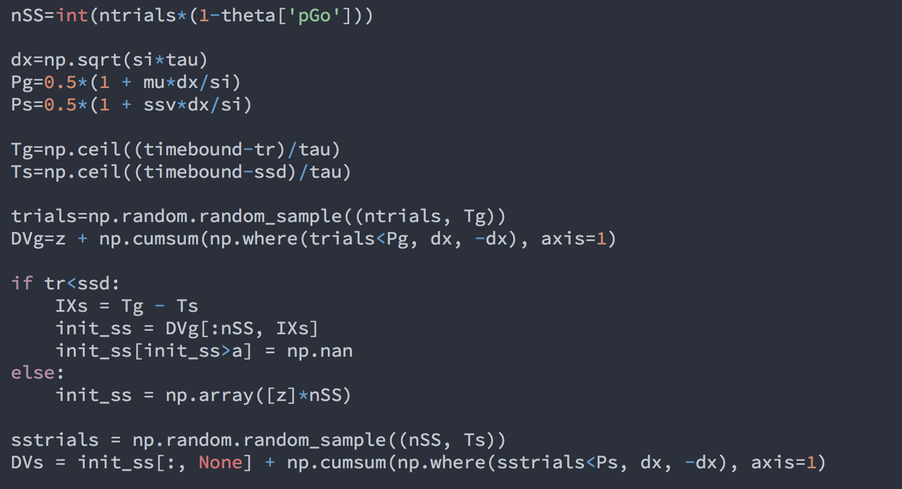
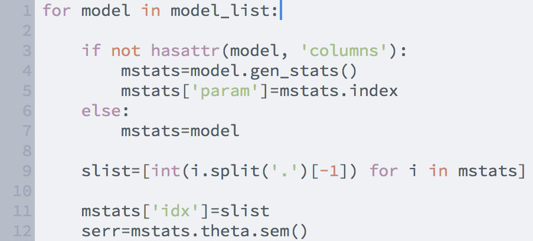

Oceans16
==========

## Theme-ify your IPython Notebooks!

This theme is essentially a mash-up of the Ocean Dark/Light IPyNB Themes by [Nikhil Sonnad](https://github.com/nsonnad/base16-ipython-notebook) and the Spacegray Ocean color schemes for Sublime Text by [Gadzhi Kharkharov](https://github.com/kkga/spacegray), which are both constructed using the original [Base16 color scheme](https://github.com/chriskempson/base16) by [Chris Kempson](https://github.com/chriskempson). General notebook and code cell layout are adapted from [this](https://github.com/panditarevolution/ipythonNotebook_customs/blob/master/monokai/custom.css) theme by [panditarevolution](https://github.com/panditarevolution). 

### IPython Notebook Home


### IPython Notebook Fullscreen View


### Python code in Oceans16 Dark  


### Python code in Oceans16 Light


- [__Source Code Pro__](https://github.com/adobe/Source-Code-Pro) font (.ttf) included in "oceans16/Fonts/"

## Install:

#### find your ipython config directory
```sh
#usually ~/.ipython/profile_default/
ipython locate profile default
```
#### make a new ipython profile and copy over custom.css/js files
```sh
#To install the Dark theme:
ipython profile create oceans16D
cp custom.js ~/.ipython/profile_oceans16D/static/custom/
cp oceans16D.css ~/.ipython/profile_oceans16D/static/custom/custom.css

#To install the Light theme:
ipython profile create oceans16L
cp custom.js ~/.ipython/profile_oceans16L/static/custom/
cp oceans16L.css ~/.ipython/profile_oceans16L/static/custom/custom.css
```
#### start a new notebook session using oceans16D profile
```sh
ipython notebook --profile=oceans16D
```
#### mmmm so theme-y...
