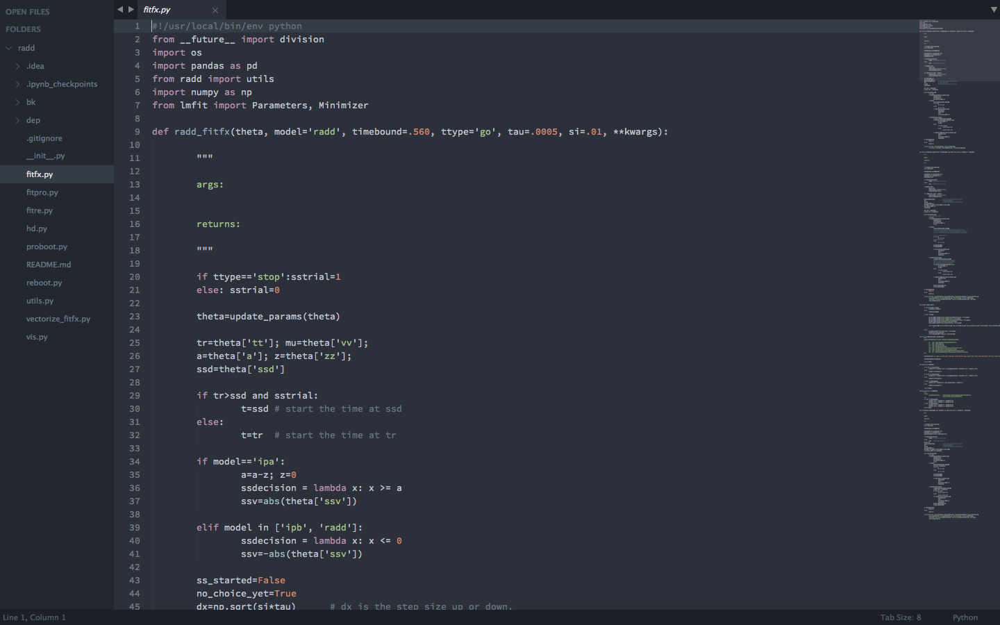
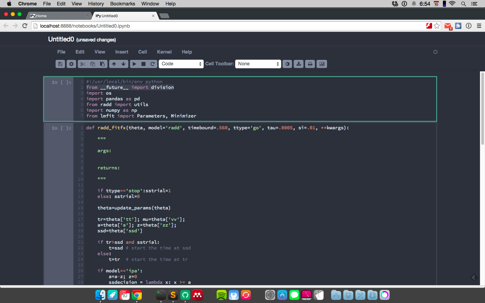

Oceans16 IPython Notebook
=========================

# Spacegray-ify your IPython Notebooks!
[base16 color schemes](https://github.com/chriskempson/base16)
[spacegray sublime theme](https://github.com/kkga/spacegray)

Based on the [Spacegray](https://github.com/kkga/spacegray) theme for Sublime Text and the [Base16](https://github.com/chriskempson/base16) Ocean Dark color scheme.

Sublime Text 3 Spacegray - Ocean Dark 

IPython Notebook Home

IPython Notebook Example NB

## Resources
Syntax colors adapted from the [Ocean Dark](https://github.com/kkga/spacegray) Color Scheme by [Gadzhi Kharkharov](https://github.com/kkga)
and the [Base16](http://chriskempson.github.io/base16/) Color Scheme by [Chris Kempson](by https://github.com/chriskempson).
CodeMirror & General NB Style was adapted from Monokai IPyNB Theme by [panditarevolution](https://github.com/panditarevolution/ipythonNotebook_customs). 
Screenshots are with my new favorite monospace font [__Source Code Pro__](https://github.com/adobe/Source-Code-Pro).