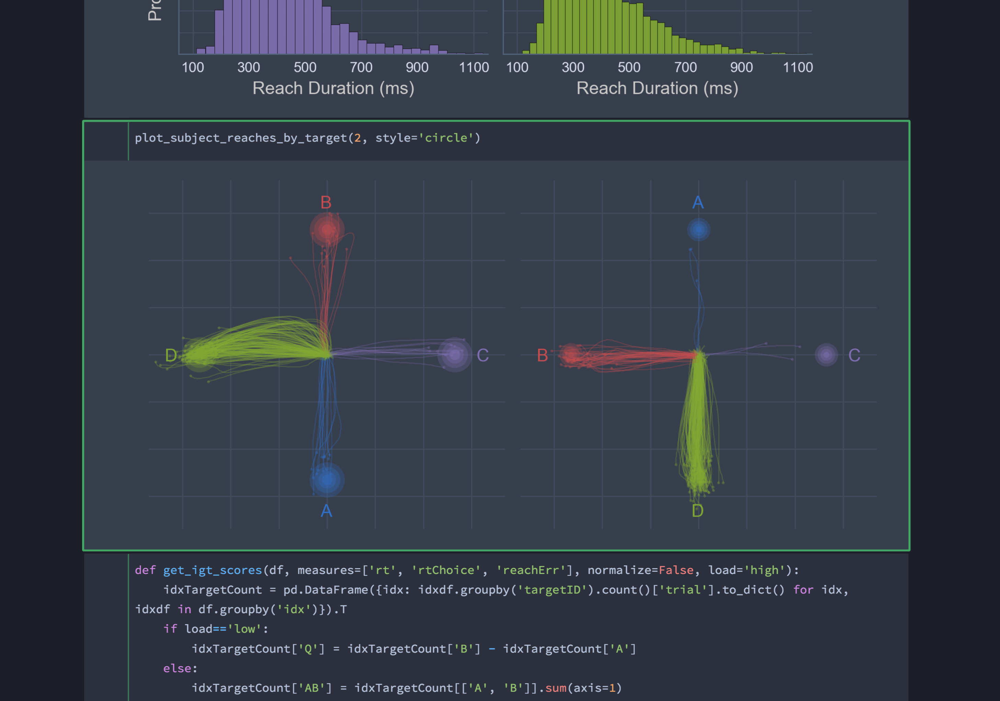

# jupyterthemes
## Theme-ify your Jupyter Notebooks!

|    Author    |                 Version                  |                  Status                  |                   Demo                   |
| :----------: | :--------------------------------------: | :--------------------------------------: | :--------------------------------------: |
| Kyle Dunovan |  |  | [](https://mybinder.org/v2/gh/dunovank/jupyter-themes/master?filepath=index.ipynb) |


#### Themes for Jupyter Lab?

Aforementioned plans to develop a CLI for customizing themes in Jupyter *Lab* are presently stalled. However, a poor-man's solution can be found [**here**](https://userstyles.org/styles/178898/jupyter-lab-legos-light) - a basic light theme that reflects many of the same and style and design properties as in the original *jupyter-themes*. 

To install this theme you'll need to install the [**Stylish**](https://userstyles.org/) browser extension (available for [**Chrome**](https://chrome.google.com/webstore/detail/stylish-custom-themes-for/fjnbnpbmkenffdnngjfgmeleoegfcffe?hl=en), [**Firefox**](https://addons.mozilla.org/en-US/firefox/addon/stylish/)).


#### Help support me

I firmly believe that software is best served open and, as such, am committed to providing free and easy access to all my code. So if you can't make a financial contribution then `pip install` it anyway! But if you're sitting on some extra cash and enjoy using a package I've developed, then any amount helps and is greatly appreciated.

Click here to make a quick donation --> [](https://www.paypal.com/cgi-bin/webscr?cmd=_s-xclick&hosted_button_id=FVXYJTEBMDE7W)


#### JT Customizable Features

#### **plotting style**


#### **markdown/equations**


#### **pandas dataframes**


#### **command palette**


### Links
* [jupyterthemes on PyPI](https://pypi.python.org/pypi/jupyterthemes/)
* [jupyterthemes on GitHub](https://github.com/dunovank/jupyter-themes)

### Requirements
* Python 3.4, 3.5, 3.6, 3.7
* Jupyter ([Anaconda](https://www.continuum.io/downloads) recommended)
* matplotlib

### Install with pip
```sh
# install jupyterthemes
pip install jupyterthemes

# upgrade to latest version
pip install --upgrade jupyterthemes
```

### Known issues
- **for best results:** use notebook>=5.6.0 (`pip install --upgrade notebook`)
- **refreshing / removing / resetting:** depending on your system, browser, etc., you may need to empty your browser cache after installing a new theme (`-t`) or attempting to restore the default (`-r`) in order for those changes to take effect. (see discussion [here](https://github.com/dunovank/jupyter-themes/issues/86)). At the very least you'll need to refresh your browser window (usually `cmd+r` or `ctrl+r`).
- **install issue:** if you get an error saying `jt` is not recognized, try [this](https://github.com/dunovank/jupyter-themes/issues/92#issuecomment-300688587) fix.
- **slow render when scrolling:** fix available [here](https://github.com/dunovank/jupyter-themes/issues/117#issuecomment-296391443)


### Command Line Usage
```
jt  [-h] [-l] [-t THEME] [-f MONOFONT] [-fs MONOSIZE] [-nf NBFONT]
    [-nfs NBFONTSIZE] [-tf TCFONT] [-tfs TCFONTSIZE] [-dfs DFFONTSIZE]
    [-m MARGINS] [-cursw CURSORWIDTH] [-cursc CURSORCOLOR] [-vim]
    [-cellw CELLWIDTH] [-lineh LINEHEIGHT] [-altp] [-altmd] [-altout]
    [-P] [-T] [-N] [-r] [-dfonts]
```

#### Description of Command Line options
| cl options            |   arg   |  default   |
| :-------------------- | :-----: | :--------: |
| Usage help            |   -h    |     --     |
| List Themes           |   -l    |     --     |
| Theme Name to Install |   -t    |     --     |
| Code Font             |   -f    |     --     |
| Code Font-Size        |   -fs   |     11     |
| Notebook Font         |   -nf   |     --     |
| Notebook Font Size    |  -nfs   |     13     |
| Text/MD Cell Font     |   -tf   |     --     |
| Text/MD Cell Fontsize |  -tfs   |     13     |
| Pandas DF Fontsize    |  -dfs   |     9      |
| Output Area Fontsize  |  -ofs   |    8.5     |
| Mathjax Fontsize (%)  | -mathfs |    100     |
| Intro Page Margins    |   -m    |    auto    |
| Cell Width            | -cellw  |    980     |
| Line Height           | -lineh  |    170     |
| Cursor Width          | -cursw  |     2      |
| Cursor Color          | -cursc  |     --     |
| Alt Prompt Layout     |  -altp  |     --     |
| Alt Markdown BG Color | -altmd  |     --     |
| Alt Output BG Color   | -altout |     --     |
| Style Vim NBExt*      |  -vim   |     --     |
| Toolbar Visible       |   -T    |     --     |
| Name & Logo Visible   |   -N    |     --     |
| Kernel Logo Visible   |   -kl   |     --     |
| Reset Default Theme   |   -r    |     --     |
| Force Default Fonts   | -dfonts |     --     |


### Command Line Examples
```sh
# list available themes
# onedork | grade3 | oceans16 | chesterish | monokai | solarizedl | solarizedd
jt -l

# select theme...
jt -t chesterish

# restore default theme
# NOTE: Need to delete browser cache after running jt -r
# If this doesn't work, try starting a new notebook session.
jt -r

# toggle toolbar ON and notebook name ON
jt -t grade3 -T -N

# toggle kernel logo.  kernel logo is in same container as name
# toggled with -N.  That means that making the kernel logo visible is
# pointless without also making the name visible
jt -t grade3 -N -kl

# set code font to 'Roboto Mono' 12pt
# (see monospace font table below)
jt -t onedork -f roboto -fs 12

# set code font to Fira Mono, 11.5pt
# 3digit font-sizes get converted into float (115-->11.5)
# 2digit font-sizes > 25 get converted into float (85-->8.5)
jt -t solarizedd -f fira -fs 115

# set font/font-size of markdown (text cells) and notebook (interface)
# see sans-serif & serif font tables below
jt -t oceans16 -tf merriserif -tfs 10 -nf ptsans -nfs 13

# adjust cell width (% screen width) and line height
jt -t chesterish -cellw 90% -lineh 170

# or set the cell width in pixels by leaving off the '%' sign
jt -t solarizedl -cellw 860

# fix the container-margins on the intro page (defaults to 'auto')
jt -t monokai -m 200

# adjust cursor width (in px) and make cursor red
# options: b (blue), o (orange), r (red), p (purple), g (green), x (font color)
jt -t oceans16 -cursc r -cursw 5

# choose alternate prompt layout (narrower/no numbers)
jt -t grade3 -altp

# my two go-to styles
# dark
jt -t onedork -fs 95 -altp -tfs 11 -nfs 115 -cellw 88% -T
# light
jt -t grade3 -fs 95 -altp -tfs 11 -nfs 115 -cellw 88% -T
```


### Set Plotting Style (from within notebook)
`jtplot.style()` makes changes to matplotlib's rcParams dictionary so that figure aesthetics match those of a chosen jupyterthemes style. In addition to setting the color scheme, `jtplot.style()` allows you to control various figure properties (spines, grid, font scale, etc.) as well as the plotting "context" (borrowed from [seaborn](https://seaborn.pydata.org/tutorial/aesthetics.html#scaling-plot-elements-with-plotting-context-and-set-context)).

Note, these commands do not need to be re-run every time you generate a new plot, just once at the beginning of your notebook or whenever style changes are desired after that.

**Pro-tip**: Include the following two lines in `~/.ipython/profile_default/startup/startup.ipy` file to set plotting style automatically whenever you start a notebook:
```py
# import jtplot submodule from jupyterthemes
from jupyterthemes import jtplot

# currently installed theme will be used to
# set plot style if no arguments provided
jtplot.style()
```

### jtplot.style() Examples
```py
# import jtplot module in notebook
from jupyterthemes import jtplot

# choose which theme to inherit plotting style from
# onedork | grade3 | oceans16 | chesterish | monokai | solarizedl | solarizedd
jtplot.style(theme='onedork')

# set "context" (paper, notebook, talk, poster)
# scale font-size of ticklabels, legend, etc.
# remove spines from x and y axes and make grid dashed
jtplot.style(context='talk', fscale=1.4, spines=False, gridlines='--')

# turn on X- and Y-axis tick marks (default=False)
# turn off the axis grid lines (default=True)
# and set the default figure size
jtplot.style(ticks=True, grid=False, figsize=(6, 4.5))

# reset default matplotlib rcParams
jtplot.reset()
```


#### Monospace Fonts (code cells)
| -f arg      | Monospace Font           |
| :---------- | :----------------------- |
| anka        | Anka/Coder               |
| anonymous   | Anonymous Pro            |
| aurulent    | Aurulent Sans Mono       |
| bitstream   | Bitstream Vera Sans Mono |
| bpmono      | BPmono                   |
| code        | Code New Roman           |
| consolamono | Consolamono              |
| cousine     | Cousine                  |
| dejavu      | DejaVu Sans Mono         |
| droidmono   | Droid Sans Mono          |
| fira        | Fira Mono                |
| firacode    | Fira Code                |
| generic     | Generic Mono             |
| hack        | Hack                     |
| hasklig     | Hasklig                  |
| inconsolata | Inconsolata-g            |
| inputmono   | Input Mono               |
| iosevka     | Iosevka                  |
| liberation  | Liberation Mono          |
| meslo       | Meslo                    |
| office      | Office Code Pro          |
| oxygen      | Oxygen Mono              |
| roboto      | Roboto Mono              |
| saxmono     | saxMono                  |
| source      | Source Code Pro          |
| sourcemed   | Source Code Pro Medium   |
| ptmono      | PT Mono                  |
| ubuntu      | Ubuntu Mono              |

#### Sans-Serif Fonts
| -nf/-tf arg   | Sans-Serif Font   |
| :------------ | :---------------- |
| opensans      | Open Sans         |
| droidsans     | Droid Sans        |
| exosans       | Exo_2             |
| latosans      | Lato              |
| ptsans        | PT Sans           |
| robotosans    | Roboto            |
| sourcesans    | Source Sans Pro   |

#### Serif Fonts
| -nf/-tf arg   | Serif Font       |
| :------------ | :--------------- |
| loraserif     | Lora             |
| ptserif       | PT Serif         |
| georgiaserif  | Georgia          |
| cardoserif    | Cardo            |
| crimsonserif  | Crimson Text     |
| ebserif       | EB Garamond      |
| merriserif    | Merriweather     |
| neutonserif   | Neuton           |
| goudyserif    | Sorts Mill Goudy |
