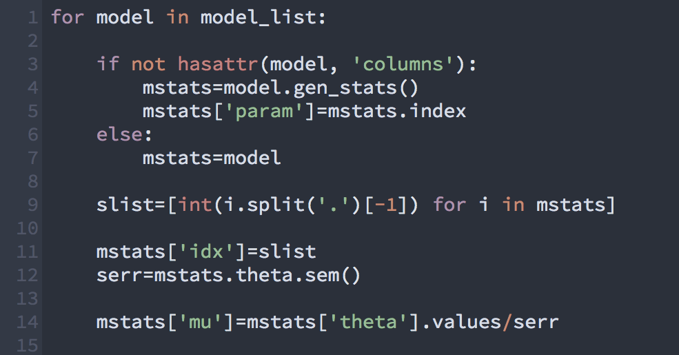
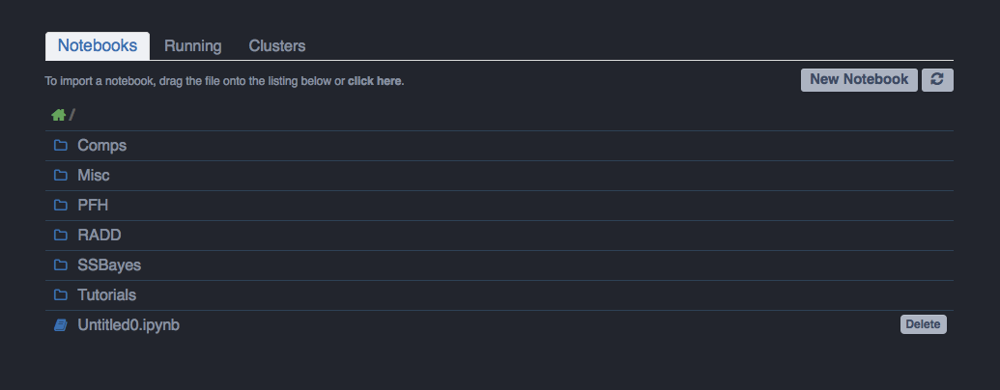
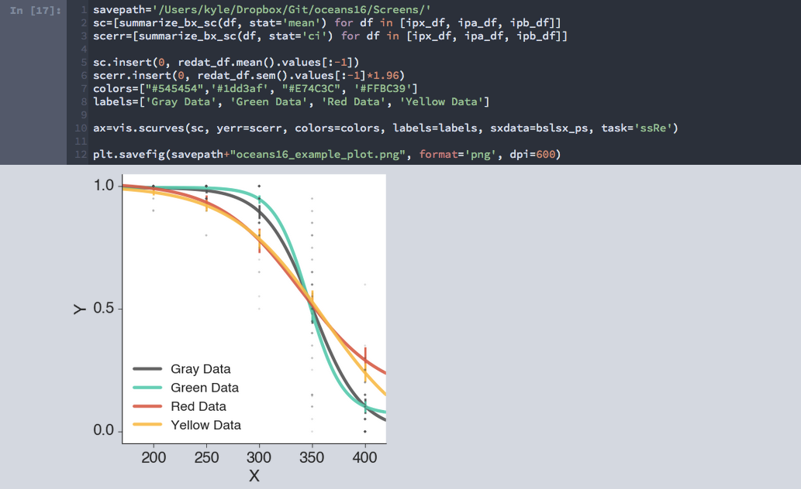

Oceans16
==========

## Dark-ify your IPython Notebooks!

This theme is essentially a mash-up of the Ocean Dark IPyNB Theme by [Nikhil Sonnad](https://github.com/nsonnad/base16-ipython-notebook)
and the default Spacegray color scheme for Sublime Text by [Gadzhi Kharkharov](https://github.com/kkga/spacegray), which are both constructed using the original [Base16 color scheme](https://github.com/chriskempson/base16) by [Chris Kempson](https://github.com/chriskempson). General notebook and code cell layout are adapted from [this](https://github.com/panditarevolution/ipythonNotebook_customs/blob/master/monokai/custom.css) theme by [panditarevolution](https://github.com/panditarevolution). 

### Python code in Oceans16 


### IPython Notebook Home


### IPython Notebook Fullscreen View


### IPython Notebook Example Output


- [__Source Code Pro__](https://github.com/adobe/Source-Code-Pro) font (.ttf) included in "oceans16/Fonts/"

## Install:

#### find your ipython profile dir
```sh
#usually ~/.ipython/profile_default/
ipython locate profile default
```

#### make a new ipython profile and copy over custom.css/js files
```sh
ipython profile create oceans16        
#From inside the cloned oceans16 repo:
cp custom.* ~/.ipython/profile_oceans16/static/custom/
```

#### start a new notebook session using oceans16 profile
```sh
ipython notebook --profile=oceans16
```

