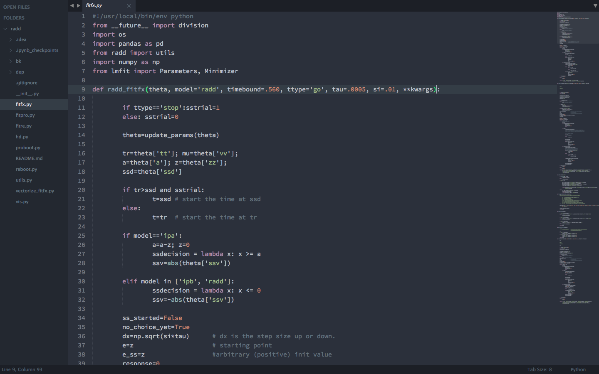
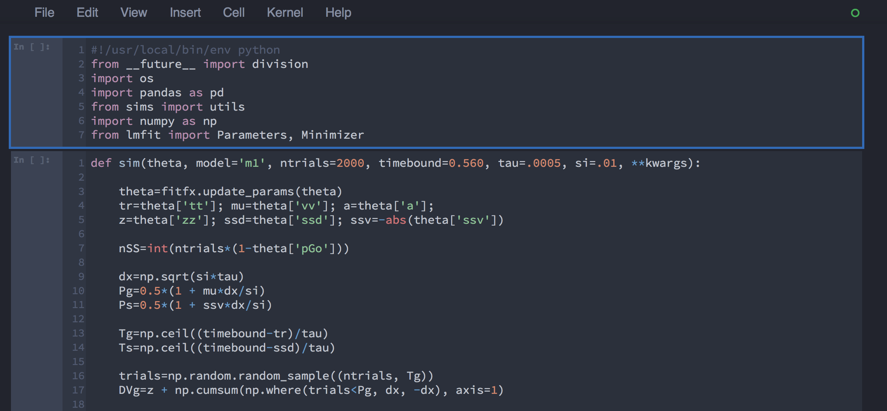

Oceans16 IPython Notebook
=========================

# Customized Ocean Dark (ish) Theme for IPython Notebooks

This theme is essentially a mash-up of the Ocean Dark IPyNB Theme by [Nikhil Sonnad](https://github.com/nsonnad/base16-ipython-notebook)
and the default Spacegray color scheme for Sublime Text by [Gadzhi Kharkharov](https://github.com/kkga/spacegray), which are both constructed using the original [Base16 color scheme](https://github.com/chriskempson/base16) by [Chris Kempson](by https://github.com/chriskempson). General notebook and code cell layout are adapted from [this](https://github.com/panditarevolution/ipythonNotebook_customs/blob/master/monokai/custom.css) custom theme by [panditarevolution](https://github.com/panditarevolution). 

Based on the [Spacegray](https://github.com/kkga/spacegray) theme for Sublime Text and the [Base16](https://github.com/chriskempson/base16) Ocean Dark color scheme.

## Sublime Text 3 Spacegray - Ocean Dark 

## IPython Notebook Home

## IPython Notebook Example Input

## IPython Notebook Example Output

** Screenshots are with my new favorite monospace font [__Source Code Pro__](https://github.com/adobe/Source-Code-Pro). **