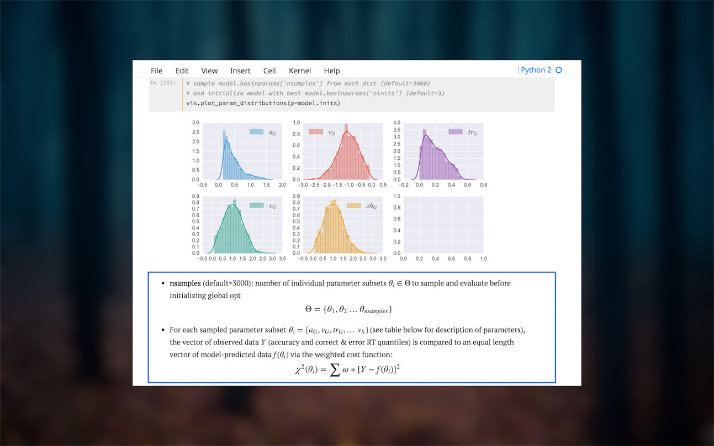
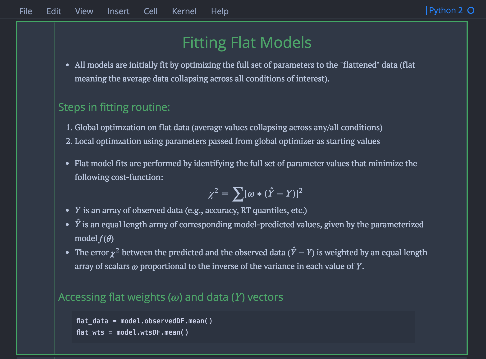
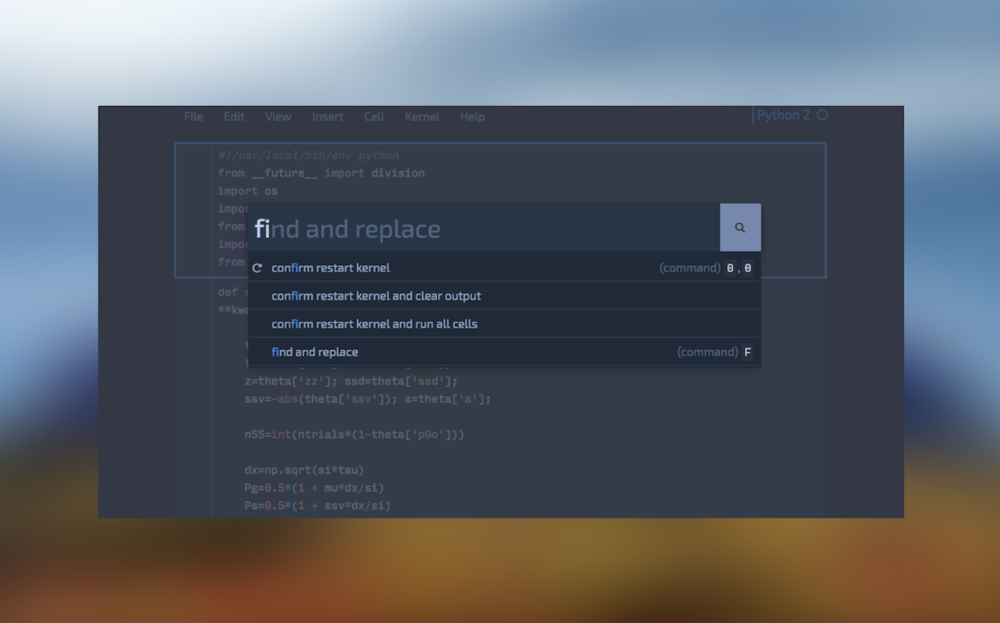
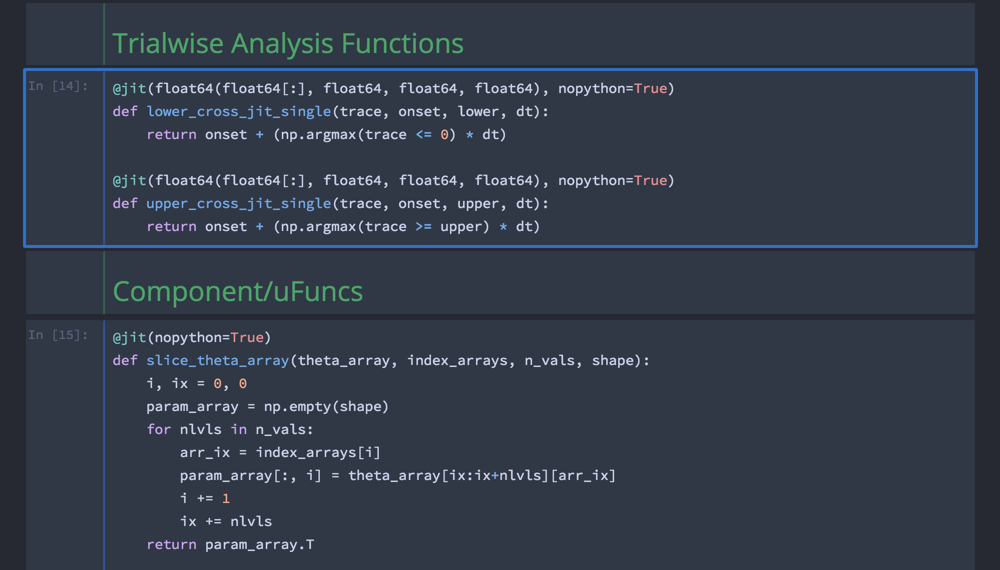
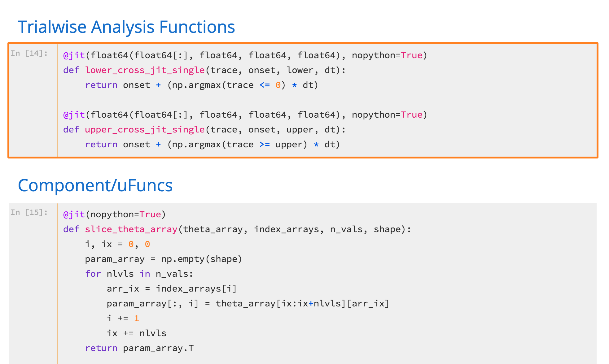
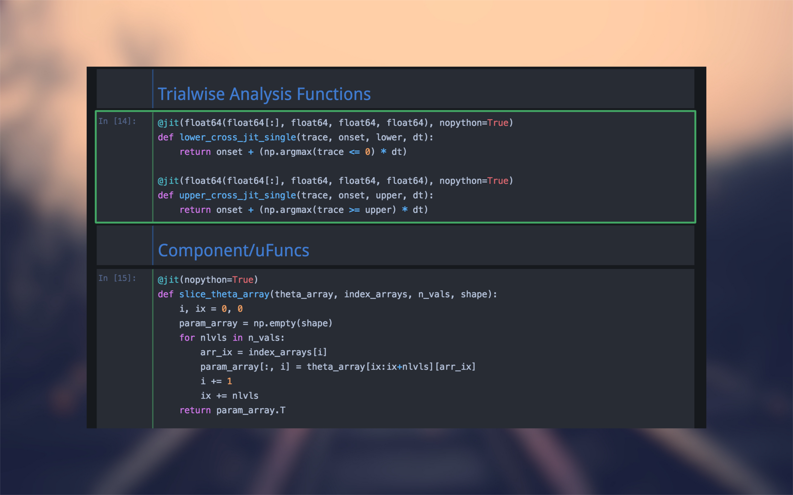
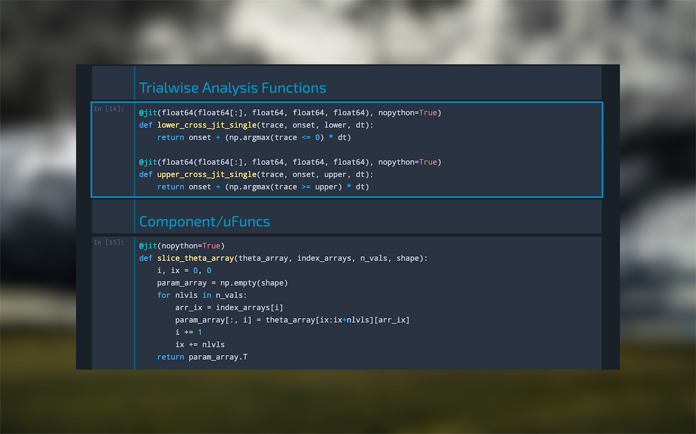

# jupyterthemes
## Theme-ify your Jupyter Notebooks!

###### *plots & equations*


###### *markdown & text cells*


###### *pandas dataframes*


###### *command palette*


###### *oceans16 syntax*


###### *grade3 syntax*


###### *onedork syntax*


###### *chesterish syntax*


### TravisCI Build status:


### Interactive Binder Demo
[](http://mybinder.org:/repo/dunovank/jupyter-themes)

### Links
* [jupyterthemes on PyPI](https://pypi.python.org/pypi/jupyterthemes/)
* [jupyterthemes on GitHub](https://github.com/dunovank/jupyter-themes)

### Requirements
* Python 2.7, 3.3, 3.4, or 3.5
* Jupyter ([Anaconda](https://www.continuum.io/downloads) recommended)

### Recent updates
###### v0.13.7
* misc visibility improvements

###### v0.13.6
* altlayout is now default for grade3 (white bg for txt/markdown)

###### v0.13.5
* full functionality has been added for Python 3.5
* better theme integration for command palette, keyboard shortcuts
* integration with Running, Clusters, and NBExtension pages.
* added font options for code-cells and notebook body
* vim nbextension compatibility provided by [alextfkd](https://github.com/alextfkd)
* customizable cursor color and size

### Install with pip
```sh
pip install jupyterthemes
```

### Command Line Usage
```
usage: jt [-h] [-l] [-t THEME] [-f MONOFONT] [-fs MONOSIZE] [-nf NBFONT]
          [-nfs NBFONTSIZE] [-tf TCFONT] [-tfs TCFONTSIZE] [-m MARGINS]
          [-cursw CURSORWIDTH] [-cursc CURSORCOLOR] [-cellw CELLWIDTH]
          [-lineh LINEHEIGHT] [-alt] [-vim] [-T] [-N] [-r]
```
|        options        |   arg     |     default   |
|:----------------------|:---------:|:-------------:|
| Usage help            |  -h       |      --       |
| List Themes           |  -l       |      --       |
| Theme Name to Install |  -t       |      --       |
| Code Font             |  -f       |   droidmono   |
| Code Font-Size        |  -fs      |      11       |
| Notebook Font         |  -nf      |    exosans    |
| Notebook Font Size    |  -nfs     |      13       |
| Text/MD Cell Font     |  -tf      |   loraserif   |
| Text/MD Cell Fontsize |  -tfs     |      13       |
| Intro Page Margins    |  -m       |     auto      |
| Cell Width            |  -cellw   |      980      |
| Line Height           |  -lineh   |      170      |
| Cursor Width          |  -cursw   |       2       |
| Cursor Color          |  -cursc   |      --       |
| Alt Text/MD Layout    |  -alt     |      --       |
| Alt Prompt Layout     |  -altp    |      --       |
| Style Vim NBExt*      |  -vim     |      --       |
| Toolbar Visible       |  -T       |      --       |
| Name & Logo Visible   |  -N       |      --       |
| Restore Default       |  -r       |      --       |

### Examples
```sh
# list available themes
# oceans16 | grade3 | chesterish | onedork
jt -l

# select theme...
jt -t chesterish

# toggle toolbar ON and notebook name ON
jt -t grade3 -T -N

# set code font to 'Roboto Mono' 12pt
# (see monospace font table below)
jt -t oceans16 -f roboto -fs 12

# set code font to Fira Mono, 11.5pt
# 3digit font-size gets converted into float (115-->11.5)
jt -t grade3 -f fira -fs 115

# set text-cell/markdown and notebook fonts
# (see sans-serif & serif font tables below)
jt -t onedork -tf georgiaserif -nf droidsans

# adjust cell width, line-height of codecells
jt -t chesterish -cellw 900 -lineh 170

# fix the container-margins on the intro page (defaults to 'auto')
jt -t onedork -m 200

# adjust cursor width (in px) and make cursor red (r)
# options: b (blue), o (orange), r (red), p (purple), g (green)
jt -t grade3 -cursc r -cursw 5

# toggle toolbar ON and notebook name ON
jt -t grade3 -T -N

# choose alternate txt/markdown layout (-alt)
# and alternate cell prompt (narrow, no numbers)
jt -t grade3 -alt -altp

# restore default theme
jt -r
```

### Monospace Fonts (codecells)
| -f arg | Monospace Font |
|:--|:--|
|anka|Anka/Coder|
|anonymous|Anonymous Pro|
|aurulent|Aurulent Sans Mono|
|bitstream|Bitstream Vera Sans Mono|
|bpmono|BPmono|
|code|Code New Roman|
|consolamono|Consolamono|
|cousine|Cousine|
|dejavu|DejaVu Sans Mono|
|droidmono|Droid Sans Mono|
|fira|Fira Mono|
|firacode|Fira Code|
|generic|Generic Mono|
|hack|Hack|
|inconsolata|Inconsolata-g|
|inputmono|Input Mono|
|liberation|Liberation Mono|
|meslo|Meslo|
|office|Office Code Pro|
|oxygen|Oxygen Mono|
|roboto|Roboto Mono|
|saxmono|saxMono|
|source|Source Code Pro|
|sourcemed|Source Code Pro Medium|
|ptmono|PT Mono|
|ubuntu|Ubuntu Mono|

### Sans-Serif Fonts
| -nf/-tf arg | Sans-Serif Font |
|:--|:--|
|exosans|Exo_2|
|opensans|Open Sans|
|droidsans|Droid Sans|
|latosans|Lato|
|ptsans|PT Sans|
|robotosans|Roboto|
|sourcesans|Source Sans Pro|
|amikosans|Amiko|
|nobilesans|Nobile|
|alegreyasans|Alegreya|
|armatasans|Armata|
|cambaysans|Cambay|
|catamaransans|Catamaran|
|franklinsans|Libre Franklin|
|frankruhlsans|Frank Ruhl|
|gothicsans|Carrois Gothic|
|gudeasans|Gudea|
|hindsans|Hind|
|jaldisans|Jaldi|
|makosans|Mako|
|merrisans|Merriweather Sans|
|mondasans|Monda|
|oxygensans|Oxygen Sans|
|pontanosans|Pontano Sans|
|puritansans|Puritan Sans|
|ralewaysans|Raleway|

### Serif Fonts
| -nf/-tf arg | Serif Font |
|:--|:--|
|loraserif|Lora|
|andadaserif|Andada|
|arapeyserif|Arapey|
|ptserif|PT Serif|
|georgiaserif|Georgia|
|cardoserif|Cardo|
|crimsonserif|Crimson Text|
|droidserif|Droid Serif|
|ebserif|EB Garamond|
|merriserif|Merriweather|
|notoserif|Noto Serif|
|vesperserif|Vesper Libre|
|scopeserif|ScopeOne|
|sanchezserif|Sanchez|
|neutonserif|Neuton|
|rasaserif|Rasa|
|goudyserif|Sorts Mill Goudy|
|vollkornserif|Vollkorn|
